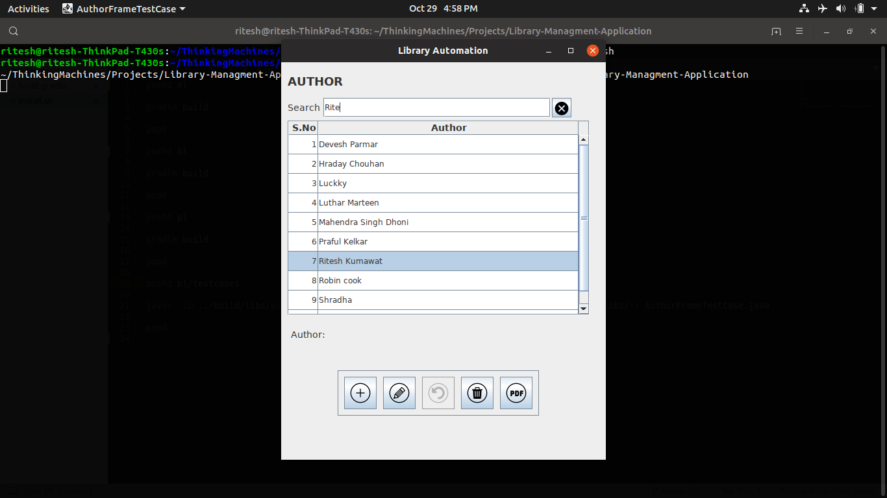

# Library-Managment-Application

Library management systems also involve maintaining the database for entering new books and authors with CRUD Operations.
Designed on the Layered Programming Approch.

Preview - 

Requirments : 
Gradle 

Steps to Run the Application -
> Clone the project -> git clone https://github.com/RiteshKumawat/Library-Managment-Application.git

For Linux -> 

>./install.sh

>./runme.sh

For Windows -> 

> install

> runme
